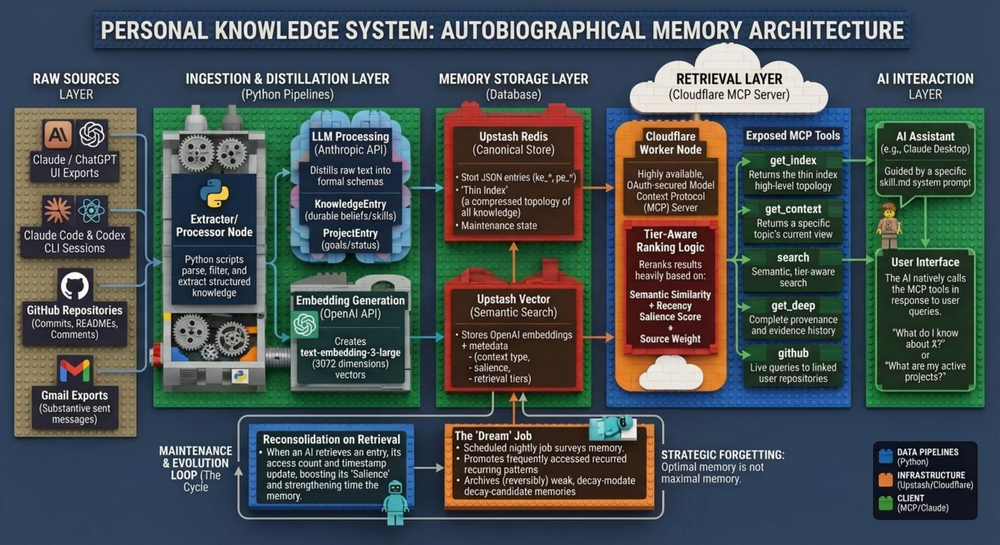

# Personal Knowledge System

This repository is building a personal memory layer for AI assistants.

The goal is not just to store past conversations. The goal is to turn a long stream of chats, coding sessions, repositories, and email into a living memory system that can:

- remember stable identity and project context
- surface the right memories for the current question
- avoid flooding the model with one-off facts
- gradually consolidate what matters
- eventually "dream" over old material and keep only the useful residue

This README is meant to explain the system, not to present it as a turnkey template. The codebase is private, opinionated, and tied to one operator's local machine, Cloudflare account, and Upstash databases.

## What We Are Building

At a high level, the system has five layers:

1. Ingestion
   It pulls raw material from AI conversation exports, coding-agent sessions, GitHub, and Gmail.
2. Distillation
   It turns raw material into structured memory entries with provenance.
3. Storage
   It stores those entries in Redis and their embeddings in Upstash Vector.
4. Retrieval
   It serves the memory through a Cloudflare-hosted MCP server with tier-aware search and thin-index summaries.
5. Maintenance
   It will promote, demote, consolidate, and archive memories over time through reconsolidation and Dream jobs.

The end state is a memory system that behaves less like a document archive and more like a selective autobiographical memory.

## The Full System Vision

The target system has these behaviors:

- durable identity and long-lived project context should be available by default
- recurring but lower-priority context should appear when it is relevant
- one-off facts should stay retrievable without constantly taking up context window space
- repeated retrieval should strengthen memories
- stale or low-value memories should be archived, not deleted blindly
- nightly or scheduled "Dream" runs should reconcile the current self-model from accumulated experience

That full design is larger than what is currently live. Some parts are already running in production; some are the next phases.

## Why Forgetting Matters

There is a specific kind of irritation that comes from watching an intelligent system confidently misread you.

I was deep in a conversation about country equity rotation signals, the kind of technical discussion that represents the actual center of my professional life, when Claude helpfully suggested that I might want to think about the question through the lens of Ayurvedic medicine because I had apparently expressed interest in Panchakarma once, in a single conversation, three months earlier.

I had asked one question. I did not need that interest preserved in perpetuity.

This is not Claude's fault. It is the fault of how AI memory systems are usually designed.

Most deployed AI memory systems run on what I think of as single-gate ingestion:

- did something appear in a conversation?
- yes
- store it forever
- full weight
- no decay
- no frequency threshold

There is no mechanism to distinguish between something discussed across a hundred professional conversations spanning decades and something mentioned once on a slow Tuesday. Everything that clears the gate is treated as equally durable, equally salient, and equally worthy of surfacing later.

The brain does not work this way.

Modern memory research makes the point clearly: optimal memory is not maximal memory. During slow-wave sleep, the hippocampus replays recent experience selectively, not uniformly. Weak signals do not consolidate like strong ones. The Synaptic Homeostasis Hypothesis proposes that sleep globally downscales synaptic strength while preserving stronger connections proportionally better, improving signal-to-noise ratio. The goal of memory is not to retain everything. The goal is to improve future decisions.

That is the design principle behind this repository.

The system is being rebuilt around a simple premise:

- forgetting is not failure
- forgetting is how a memory system becomes useful

### What The Old System Got Wrong

Before the current upgrade, the memory layer behaved too much like a write-only archive.

Entries such as:

- "Ayurvedic medicine — Panchakarma therapy"
- "NFL playoff psychology"

could sit at effectively the same retrieval weight as:

- "30 years in quantitative investing"
- "Senior Advisor at GMO"

The system had no real evidence model. It had almost no way to distinguish durable identity from incidental curiosity. It also was not properly learning from use: access counters and last-accessed timestamps were not wired into retrieval behavior, so the store could accumulate entries without any feedback loop telling it which ones continued to matter.

The result was completeness without judgment.

### Evidence Strength

The first structural change was to make the system aware of what it does not yet know: how strong the evidence is behind any given memory.

Every entry now carries a `context_type`, a classification of why the information is being stored. The taxonomy runs from stable identity and active project context down to task-query and passing-reference material.

Every entry also carries a `mention_count`, which tracks how many independent source conversations or source clusters surfaced that topic. This is the frequency signal the system uses to distinguish a durable pattern from a one-off appearance.

From there, the system derives an `injection_tier`:

- Tier 1
  Stable identity, stated preferences, and active projects.
- Tier 2
  Recurring patterns and medium-priority topic-adjacent context.
- Tier 3
  Passing references and direct-query-only material.

The important property is that Tier 3 material does not need to vanish to stop being intrusive. It can remain fully retrievable while no longer surfacing uninvited.

### The Salience Function

Evidence strength is not binary. It is continuous, and it changes over time.

The salience model in this repository combines:

- recency decay, with different half-lives by context type
- mention frequency, with diminishing returns
- type multipliers, so identity and project context are not treated like passing references
- a small retrieval bonus, so repeatedly used memories can strengthen over time

This lets the system represent a practical difference between:

- a core professional identity fact that should remain available indefinitely
- a one-off query that should become functionally invisible unless reinforced

This is the software analog of strategic forgetting: preserve what matters, but stop letting weak traces compete for attention forever.

### The Dream Job

The most ambitious part of the design is the Dream job.

Dream is partially live now. The scheduler, audit trail, candidate discovery loop, reversible archive/restore mechanics, and write-capable operator tools are implemented. The nightly Worker is now configured for full live runs of the currently implemented Dream engine. Replay-heavy consolidation is still planned. The intended structure is:

1. Survey
   Load active entries, compute salience, and bucket them into stable, active, weak, and decay candidates.
2. Replay
   Scan recent activity for repeated topics, contradictions, promotion candidates, and duplicates.
3. Consolidate
   Upgrade context where warranted, merge duplicates, recompute salience, and log the changes.
4. Prune
   Archive weak, low-evidence, low-use entries into a reversible namespace instead of deleting them.

The point of Dream is not to erase the past. The point is to keep the active memory layer aligned with what remains useful.

### Reconsolidation On Retrieval

The shorter-horizon companion to Dream is reconsolidation on retrieval.

This is now live. The behavior is straightforward:

- every meaningful retrieval becomes a write event
- access count increments
- last accessed updates
- the system can reconsider whether the memory has earned a stronger context type or tier

In other words, use matters. A memory that continues to be retrieved across different conversations should not be treated the same way as one that was never touched again after ingestion.

### The Larger Point

The problem here is not specific to Claude. It is a design philosophy problem that shows up across AI memory systems.

Most systems are optimized for recall coverage:

- do not miss anything
- do not forget anything
- preserve everything forever

But a memory system that never forgets is not automatically intelligent. It may simply be a system that traded judgment for completeness.

The brain solved this a long time ago:

- fast encoding
- slow integration
- selective replay
- active weakening of noise
- durable retention for what survives repeated relevance

That is the model this repository is trying to approximate.

The goal is not a perfect record.

The goal is a memory system that gets better at representing what matters.

## System Model

Current high-level schema:



```text
Raw Sources
  Claude exports
  ChatGPT exports
  Claude Code sessions
  Codex CLI sessions
  GitHub repos
  Gmail

        |
        v

Ingestion + Distillation
  Python pipelines extract structured entries
  Models assign provenance, summaries, and embeddings
  Migration/backfill scripts normalize old data

        |
        v

Memory Store
  Upstash Redis
    knowledge:{id}
    project:{id}
    index:current
    migration flags
    future Dream/reconsolidation state

  Upstash Vector
    one embedding per active entry
    metadata for retrieval filters and scoring

        |
        v

Retrieval Layer
  Cloudflare Worker MCP server
  OAuth-enabled public interface
  thin index
  semantic search
  context retrieval
  health/status endpoint

        |
        v

Future Maintenance Layer
  reconsolidation on repeated access
  Dream coordinator and archive pipeline
  operator tools for restoration and overrides
```

## Memory Model

The system stores two primary entry types:

- `KnowledgeEntry` (`ke_*`)
  A durable belief, skill, preference, technique, or topic model.
- `ProjectEntry` (`pe_*`)
  An ongoing effort with goals, status, phase, blockers, and decisions.

Each entry has a `schema_version` and migration-safe metadata. The important fields in the current design are:

- `context_type`
  What kind of memory this is: identity, project, pattern, task-query, and so on.
- `injection_tier`
  How aggressively this memory should be surfaced.
- `salience_score`
  A score derived from confidence, recency decay, mention frequency, context type, and recent retrieval.
- `classification_status`
  Whether the entry has been backfilled/classified yet.
- `archived`
  Whether the entry should be excluded from normal retrieval.

### Retrieval Tiers

The system is moving toward a three-tier memory model:

- Tier 1
  Durable identity, long-running projects, and context that should often be available.
- Tier 2
  Recurring, topic-adjacent, or medium-priority context.
- Tier 3
  One-off or direct-query-only context that should stay searchable but not dominate context injection.

This tiering is the main mechanism for preventing the memory system from becoming a pile of equally weighted notes.

## Retrieval Model

The production MCP server exposes:

- `get_index`
  Returns the thin-index subset plus true totals and tier counts.
- `get_context`
  Returns the current view of the best matching active topic or project.
- `get_deep`
  Returns the full stored entry with provenance.
- `search`
  Performs tier-aware semantic retrieval.
- `github`
  Queries linked GitHub repositories live.

Search no longer uses a simple "70% relevance + 30% recency" rule. The current design reranks results using:

- semantic similarity
- recency
- salience
- source weights
- retrieval tier

Archived entries remain in storage but are excluded from normal retrieval by default.

## Thin Index

The thin index is the compressed map of the memory system.

It is intentionally not a full dump of every entry. It stores:

- a token-budgeted subset of topics and projects
- true total topic/project counts
- tier counts
- archive counts
- recent evolution summaries

This lets a client get a fast overview of the memory landscape without paying the cost of loading the entire store.

## Dream And Reconsolidation

These are the main pieces still being built.

### Reconsolidation

Reconsolidation is the short-horizon maintenance loop. The idea is:

- retrieval increments access counters
- frequently re-accessed memories get promoted or refreshed
- repeated retrieval can strengthen salience
- the system records consolidation notes and errors

This is Phase 4 work and is live.

### Dream

Dream is the long-horizon maintenance loop. The idea is:

- run on a schedule
- revisit the memory graph in batches
- keep durable context
- archive low-value memories with reversible pointers
- rebuild the current self-model without re-injecting everything forever

Dream is Phase 5 work. The live scheduler, audit output, reversible archive/restore path, and write-capable operator tools are implemented. The last recorded Dream run can still show `dry_run` if it predates the latest deploy, but the deployed scheduler is now set for full live runs of the currently implemented Dream path.

## What Is Live Today

As of March 27, 2026, the live system has:

- `573` knowledge topics
- `36` projects
- schema version `2`
- completed Phase 1, Phase 2, Phase 3, and Phase 4 of the current memory upgrade
- `0` pending classifications in `classification:pending`
- tier counts of `500` Tier 1, `24` Tier 2, `85` Tier 3
- `0` archived entries at the time of the latest health check
- latest recorded Dream run surfaced `78` archive candidates and may still show `dry_run` if it predates the latest deploy
- the deployed scheduler is now configured for full live Dream runs on the next scheduled run
- reversible archive snapshot and restore semantics have been verified on live data, and the full archive -> MCP restore -> MCP context override path has been validated on staging

Operationally, the following are live:

- Python ingestion/distillation pipelines
- shared salience policy between Python and TypeScript
- vector metadata normalization
- rebuilt thin index with tier/salience metadata
- OAuth-enabled Cloudflare MCP server
- background reconsolidation on retrieval
- write-capable MCP tools for `restore_archived` and `set_context_type`
- nightly bounded-live Dream scheduler and audit records
- reversible Dream archive snapshot and restore mechanics
- `/health` and `/status` rollout endpoints

Not live yet:

- replay-heavy Dream consolidation such as duplicate merges and contradiction handling
- external-runner fallback for heavier Dream work

## How The Repo Is Organized

```text
knowledge-system/
  ingestion/
    github/, gmail/, agent_sessions/
    Python ingestion pipelines for ongoing raw-source intake

  distillation/
    Original export-processing pipeline for Claude/ChatGPT data
    Also contains storage clients, models, and thin-index generation

  scripts/
    Migration and verification scripts
    backfill_context_type.py
    backfill_counts.py
    verify_memory_consistency.py

  shared/
    Cross-language policy files
    memory_policy.json
    salience_fixtures.json

  cloudflare-mcp/mcp-server/
    Production MCP server
    Cloudflare Worker, OAuth wrapper, retrieval tools

  mcp-server/
    Legacy server implementation
    Not the production target

  docs/
    PRDs, audit notes, and upgrade checklists

  skill/
    Claude skill instructions for using the memory system
```

## Operational Surfaces

### Worker Endpoints

The public Worker exposes:

- `/sse`
- `/mcp`
- `/authorize`
- `/token`
- `/register`
- `/.well-known/oauth-authorization-server`
- `/health`
- `/status`

### Health Endpoint

`/health` and `/status` are the main operator-facing rollout checks. They report:

- schema version
- migration completion state
- pending classification count
- last Dream run timestamp
- thin-index totals
- tier counts
- archived count

### Migration Scripts

The upgrade work introduced three important operator scripts:

- `scripts/backfill_context_type.py`
  LLM classification pass for old entries.
- `scripts/backfill_counts.py`
  Deterministic metadata/vector normalization and thin-index rebuild.
- `scripts/verify_memory_consistency.py`
  Redis vs Vector vs thin-index verification.

These scripts are how the repo moved from legacy mixed-schema data to the current retrieval model.

## Validation Strategy

This repo now has an explicit testing plan. The goal is to validate the full memory loop, not just confirm that individual scripts exit successfully.

The three operating layers are:

- fixture tests for deterministic logic and policy behavior
- staging end-to-end tests against isolated Redis, Vector, and Worker infrastructure
- production canaries for bounded live verification only

The testing system is documented in [docs/testing-matrix.md](/Users/arjundivecha/Dropbox/AAA%20Backup/A%20Working/Memory/knowledge-system/docs/testing-matrix.md).

The root [Makefile](/Users/arjundivecha/Dropbox/AAA%20Backup/A%20Working/Memory/knowledge-system/Makefile) is the command surface for this work. The current starter commands are:

- `make worker-typecheck`
- `make worker-test`
- `make test-python-checker`
- `make verify-memory-full`
- `make check-overnight-dream`
- `make seed-staging-dry-run`
- `make staging-smoke-dry-run`
- `make staging-smoke`
- `make worker-secrets-staging`
- `make deploy-staging`
- `make dream-live-canary`

The long-term rule is simple: production is not the default test bed.

The staging smoke path is now production-shaped. It covers:

- fixture seeding into isolated staging Redis and Vector
- staging Worker `/health`
- unauthorized operator rejection
- Dream dry-run on staging
- bounded live Dream archive on staging
- OAuth discovery, client registration, auth-code exchange, and bearer-token issuance
- MCP `initialize`, `tools/list`, `get_index`, `search`, `get_context`, `get_dream_summary`, `restore_archived`, and `set_context_type`
- health verification after archive and after restore
- final Redis vs Vector vs thin-index consistency verification

There is now also a local Worker-runtime test layer under [cloudflare-mcp/mcp-server/test](/Users/arjundivecha/Dropbox/AAA%20Backup/A%20Working/Memory/knowledge-system/cloudflare-mcp/mcp-server/test). It runs inside Cloudflare's `workerd` runtime and covers:

- `/health`
- unauthorized operator rejection
- OAuth discovery, client registration, auth-code exchange, and token issuance
- MCP `initialize`, `tools/list`, `get_index`, and `get_dream_summary`
- write-tool rejection without `mcp:write`
- scheduled bounded-live Dream trigger wiring

That local test layer is automated in GitHub Actions at [.github/workflows/worker-runtime-tests.yml](/Users/arjundivecha/Dropbox/AAA%20Backup/A%20Working/Memory/knowledge-system/.github/workflows/worker-runtime-tests.yml).

## Current Upgrade Status

The repository is in the middle of a larger PKS memory upgrade.

Completed:

- Phase 0 audit and gap analysis
- Phase 1 schema and migration hooks
- Phase 2 live backfill and normalization
- Phase 3 tier-aware retrieval and rollout status endpoint
- Phase 4 reconsolidation on retrieval
- Phase 5 bounded Dream control plane, archive/restore path, and staging validation
- Phase 6 operator tool surface and write-scope enforcement

Next:

- replay-heavy Dream logic such as duplicate merge and contradiction handling
- ingestion hardening and source-fusion improvements
- broader fixture and ranking coverage in the automated test stack

The upgrade checklist lives in `docs/pks-memory-upgrade-checklist.md`.

## Important Reading Order

If you are trying to understand the system, read in this order:

1. this README
2. `docs/pks-memory-upgrade-checklist.md`
3. `docs/pks-memory-upgrade-phase0-audit-2026-03-26.md`
4. `cloudflare-mcp/mcp-server/src/index.ts`
5. `distillation/models/entries.py`
6. `distillation/pipeline/index.py`
7. `shared/memory_policy.json`

That path gives the clearest picture of the actual architecture and the upgrade trajectory.

## Design Principles

The system is trying to enforce a few simple rules:

- memory should be selective, not exhaustive
- provenance matters
- retrieval quality matters more than raw storage volume
- the system should prefer reversible archival over destructive cleanup
- scoring rules should be shared across languages and runtimes
- health and migration state should be observable, not implicit

## Version History

- **1.2.0** (March 2026)
  Schema v2 migration, context-type backfill, tier-aware retrieval, shared salience policy, `/health` endpoint, OAuth-enabled Worker deployment.
- **1.1.0** (March 2026)
  Agent session ingestion, GitHub repo linking, launchd daemon, model upgrade to Claude Sonnet 4.6.
- **1.0.1** (March 2026)
  GitHub and Gmail ingestion pipelines, recency weighting, source-based scoring, thin-index compaction.
- **1.0.0** (December 2024)
  Initial implementation with distillation pipeline, Cloudflare MCP server, and Claude integration.

## License

Private repository. Not for redistribution.
