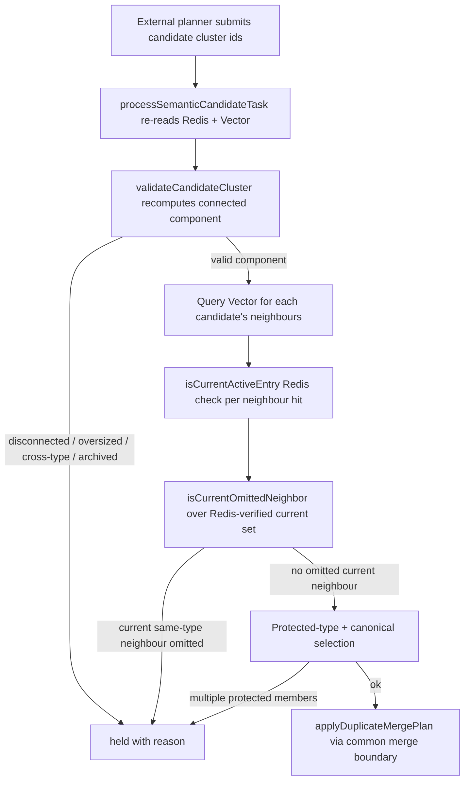

# Cloudflare MCP and Dream control plane

`cloudflare-mcp/mcp-server/` is the current production runtime for retrieval and memory governance.

It is a Cloudflare Worker implementation that uses the MCP SDK, Upstash Redis, Upstash Vector, OpenAI embeddings, and a small set of policy modules to shape both search and mutation behavior.

## What lives here

This server is the live control plane for:

- MCP tool serving
- retrieval ranking and policy shaping
- salience computation
- Dream proposal generation, grading, apply, rollback, and verification
- judge queue management
- scheduled async Dream support
- OpenAI-compatible read surfaces
- Twitter and GitHub helper flows

The top-level `AGENTS.md` says this is the current production path and should be inspected first for live MCP behavior.

## Main entrypoints

### `src/index.ts`

The main server file wires together:

- authentication and OAuth handling
- read-only and mutating MCP tools
- retrieval helpers
- Dream operations
- judge queue utilities
- tripwires and rate limiting
- source-specific helpers such as tweets and GitHub lookup

The file is large because it owns the full tool surface, but its major responsibilities are still fairly coherent: route, authorize, rank, and delegate to the right memory operation.

### `src/dream.ts`

Contains the core Dream logic and memory mutation helpers.

Recent history and code evidence show this module handles:

- proposal generation
- grading
- bounded apply
- rollback
- duplicate merge and contradiction handling
- scheduled governance operations
- insight synthesis support for content-bearing verdicts

### `src/judgeQueue.ts`

Manages the Worker-side judge queue.

The queue exists so borderline Dream operations can be judged offline and settled later. It now includes an `insight_synthesis` op type, which is the content-bearing verdict path introduced in the recent commit history.

### `src/scheduledDreamAsync.ts`

Implements the async scheduled Dream contract used by the newer orchestrator work.

It enforces:

- idempotent starts
- a per-date Redis lock
- mode gating for shadow vs live
- terminal status validation
- separation between accepted status and executed behavior

### Policy modules

Relevant policy/helper files include:

- `src/salience.ts`
- `src/retrievalPolicy.ts`
- `src/phase8Retrieval.ts`
- `src/phase9OutcomeGate.ts`
- `src/tripwires.ts`
- `src/consolidation.ts`

These modules are where the repo encodes its memory-specific heuristics, thresholds, and safety rules.

## Retrieval behavior

Retrieval is not a plain vector lookup.

The code uses additional policy shaping such as:

- topic bucket classification
- cross-context penalties
- quarantine suppression
- salience scoring and source weighting
- phase-specific retrieval gates

The goal is to keep unrelated memories from surfacing uninvited while still allowing them to be found on direct query.

`retrievalPolicy.ts` documents the rationale for this in code comments: the primary fix for unwanted cross-topic surfacing is to score down unrelated items rather than hard-filtering them.

## Dream governance

Dream is the repository's maintenance and consolidation system.

The current code and recent docs show it is no longer just a simple archive job. It now includes:

- candidate discovery
- proposal creation
- deterministic grading
- revision-pinned evidence support sets for every proposed mutation
- bounded live apply
- rollback mechanics
- duplicate merge handling
- contradiction handling
- judge queue interplay
- outcome-quality gating
- content-bearing insight synthesis in the judge path, with at least three
  in-cluster supporting entry IDs persisted on the resulting memory

The evidence gate is structural rather than an LLM score. Every operation's
`evidence.support_entry_ids` must be non-empty, contained in the proposal
snapshot, backed by `candidate_revisions`, and cover every entry the operation
touches. Insight verdicts use the same principle: support IDs must come from
the judged cluster, and an append anchor must itself be in the support set.

This is the place to look when the repo changes what counts as durable memory, how memories are consolidated, or when a nightly maintenance action becomes safe to apply.

## Semantic candidate authority and stale-row guard

Externally planned semantic duplicate candidates (from the Python planner) are
not trusted. `processSemanticCandidateTask` in
`cloudflare-mcp/mcp-server/src/dream.ts` is the Worker-side queue authority: it
re-reads current Redis entries and vectors, revalidates the cluster against
current policy and revisions, chooses the canonical winner, and only then
delegates to the common merge boundary. A terminal result is cached before
acknowledgement so at-least-once queue delivery is harmless.

The candidate guard enforces, in order:

1. `validateCandidateCluster` (in `semanticMaintenance.ts`) recomputes the
   connected component from freshly loaded vectors using the Upstash COSINE
   score scale and rejects disconnected, oversized, cross-type, archived, or
   vector-missing clusters.
2. The stale-row guard: for each candidate vector, the Worker queries Vector
   for neighbours, then filters every hit through `isCurrentActiveEntry` (a
   Redis existence + non-archived check) before considering it a current
   same-type neighbour. Vector can retain stale rows after a Redis entry is
   removed or archived, so a hit is safety-relevant only after this Redis check.
   `isCurrentOmittedNeighbor` (in `semanticMaintenance.ts`) then decides
   whether a current, same-type, above-threshold neighbour was omitted from
   the submitted candidate; if so the task is held with reason
   `candidate_component_incomplete`.
3. Protected context types (`explicit_save`, `professional_identity`,
   `stated_preference`) are blocked at the common automatic apply boundary
   (`assertAutomaticMergeAllowed`); a cluster with more than one protected
   member is held with reason `multiple_protected_members`.

This guard embodies `contracts/durable-semantic-consolidation-v2.spec.md`
INV1 (the Worker re-reads current Redis and Vector and rejects stale or
incomplete clusters) and the maintenance-side form of INV10 (Vector hits are
validated against current Redis state before being trusted).

The candidate validation flow: an externally planned cluster is revalidated against current Redis and Vector before any merge is authorized.

When changing this guard, the focused test is
`cloudflare-mcp/mcp-server/test/durableSemanticConsolidation.test.ts`
("ignores stale or cross-type vector neighbours"), which pins that a stale
vector hit (not in the Redis-verified `currentEntryIds` set) is ignored and a
live same-type hit is not. The minimal validation is the Worker Vitest suite
(`make worker-test`, i.e. `npx vitest run --no-file-parallelism` in
`cloudflare-mcp/mcp-server`); for a narrow run target the contract's G3 gate
uses `test/semantic-dedup.test.ts`.

## Hard merge gates and the semantic cursor

Two pure-logic modules back the lossless-merge and starvation-free-sweep
contracts behind semantic consolidation.

`cloudflare-mcp/mcp-server/src/mergeGates.ts` is the "Ring 1" hard gate for
every duplicate merge. It is wired unconditionally into
`applyDuplicateMergePlan` (the single choke point for both the governed nightly
path and the legacy operator path) and provides:

- `collapseNearDuplicateInsights` — deterministic Jaccard word-overlap collapse
  of near-identical insights, returning a drop-to-retained receipt mapping so no
  insight disappears without a receipt (INV5).
- `validateMergeConservation` — an independent post-hoc gate that recomputes
  the expected merge output from the parent entries alone and compares it
  against what the merge actually produced; a failing merge is never persisted
  (INV3).

The scheduled duplicate-merge cap is coupled to these gates by code, not merely
by convention: `resolveScheduledDuplicateMergeLimit` in `index.ts` clamps the
cap to 10 unless `merge_hard_gates_active` is literally `true` in
`shared/memory_policy.json`. The policy currently has
`merge_hard_gates_active: true` and `scheduled_duplicate_merge_limit: 50`, so
the gates are live and the cap is 50. Raising the cap requires flipping the
gate flag in the same change.

`cloudflare-mcp/mcp-server/src/semanticCursor.ts` is the rolling cursor that
bounds the nightly semantic-dedup slice to at most 200 candidates and 400
vector queries per run (Worker subrequest budget). It persists only a numeric
position and cycle bookkeeping in a single Redis key; the caller re-derives the
sorted candidate id list every run. `advanceSemanticCursor` is called only
after a completed slice, so a crashed mid-sweep run retries the same slice next
night (starvation-free, INV4). The slice is currently disabled:
`SEMANTIC_SLICE_SIZE: 0` in `shared/memory_policy.json` short-circuits the pass
before it loads anything, after the semantic slice's extra full-corpus load blew
the Cloudflare subrequest cap and killed the nightly Dream (see the policy's
`_subrequest_note`). Do not raise it until the nightly stops loading the whole
corpus multiple times and a real run has measured subrequest headroom.

The contracts behind both modules live in
`contracts/semantic-consolidation.spec.md` (PKS-SEMANTIC-CONSOLIDATION-001) and
`contracts/durable-semantic-consolidation-v2.spec.md`
(PKS-DURABLE-SEMANTIC-CONSOLIDATION-002). Focused tests:
`test/mergeGates.test.ts` (lossless-merge fixture library, G2 gate) and
`test/semanticCursor.test.ts` plus `test/semantic-dedup.test.ts` (bounds and
cursor coverage, G3 gate).

## Read/write tool surface

`AGENTS.md` notes the production server exposes read-only tools such as index, context, deep retrieval, search, and health, and write tools that require `mcp:write` scope.

If you are changing one of these tools, verify whether the change affects:

- auth scopes
- OpenAI-compatible routes
- retrieval ranking
- judge queue settlement
- Dream apply/revert flows
- tests in `cloudflare-mcp/mcp-server/test/`

## Important caution

There are two MCP implementations in the repo.

- `cloudflare-mcp/mcp-server/` is the current production Worker path.
- `mcp-server/` is the older Vercel-style implementation.

Do not treat them as interchangeable. They share intent, but their runtime environment and current responsibilities differ.

## Main source anchors

- `cloudflare-mcp/mcp-server/src/index.ts`
- `cloudflare-mcp/mcp-server/src/dream.ts`
- `cloudflare-mcp/mcp-server/src/judgeQueue.ts`
- `cloudflare-mcp/mcp-server/src/scheduledDreamAsync.ts`
- `cloudflare-mcp/mcp-server/src/salience.ts`
- `cloudflare-mcp/mcp-server/src/retrievalPolicy.ts`
- `cloudflare-mcp/mcp-server/src/phase8Retrieval.ts`
- `cloudflare-mcp/mcp-server/src/phase9OutcomeGate.ts`
- `cloudflare-mcp/mcp-server/src/semanticMaintenance.ts`
- `cloudflare-mcp/mcp-server/src/mergeGates.ts`
- `cloudflare-mcp/mcp-server/src/semanticCursor.ts`
- `cloudflare-mcp/mcp-server/test/`
- `cloudflare-mcp/mcp-server/package.json`
