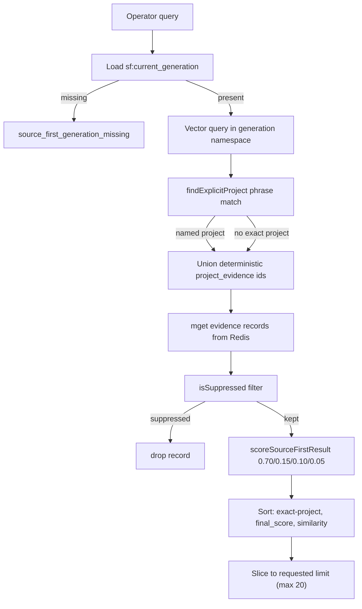

# Source-first memory model

Source-First Memory is the current production serving model for this
repository. It replaced the earlier self-modifying PKS memory model, in which
retrieval was shaped by LLM-inferred identity, salience scores, access
reinforcement, and overnight Dream mutation. Source-first instead retrieves
recent, authoritative evidence directly from source documents without
inferring identity, assigning salience, reinforcing accessed results, or
rewriting the corpus overnight.

The design intent and operator-facing contract are documented in
`docs/source-first-memory.md`. This page is the code-grounded companion:
it maps the data contract, the build/publish lifecycle, the retrieval
scoring path, and the exact source symbols that own each behavior.

The relationship to the prior model is important: the
[Cloudflare MCP and Dream control plane](../architecture/mcp-and-dream.md)
and the [memory model and business logic](memory-model.md) it governed are
now the **legacy/staging** path. Production (`wrangler.json` top-level
`vars`) sets `SOURCE_FIRST_MODE: "on"`; the staging Worker environment keeps
`SOURCE_FIRST_MODE: "off"` with `DREAM_QUEUE_MODE: "live"` so the Dream and
semantic-consolidation machinery can still be exercised in staging. See
[Source-first rebuild workflow](../workflows/source-first-rebuild.md) for
how generations are built and promoted.

## Data contract

Every evidence record is immutable. The canonical shape is
`EvidenceRecord` in `ingestion/source_first/models.py`:

- `id` — deterministic `ev_*` identity derived from logical source, chunk, and checksum.
- `source_id` — stable family ID used to retrieve all chunks from one source.
  (24 hex chars for scanned files; `ev_curated_<16hex>` for curated entries).
- `title` — first `#`/`##`/`###` heading in the file, or the parent dir / stem.
- `text` — a normalized, boilerplate-stripped text chunk.
- `source_path` — the exact filesystem path (or `curated://<id>` for curated).
- `source_kind` — `working_project`, `completed_project`, `curated_memory`,
  `operating_policy`, `claude_code_session`, or `codex_session`.
- `project` — derived project name, or `null` for curated/global files.
- `source_modified_at` — file mtime as ISO UTC.
- `content_checksum` — sha256 of the chunk text.
- `chunk_index` / `chunk_count` — chunk position within the source file.
- `authority` — a fixed per-source-kind weight from `source_authority` in
  `shared/source_first_config.json` (curated/policy = 1.0, working = 0.9,
  completed = 0.9; session working context = 0.7).
- `evidence_role` — `authoritative` or `working_context`.
- `session_surface`, `session_id`, session timestamps, and
  `attention_observed_at` — null for normal files and populated for sessions.
- `pinned` — true for explicit curated/policy files.

The index contains **no** context classifier, injection tier, salience score,
access count, or LLM-generated canonical view. This is the core product
difference from the legacy model.

Recent Claude Code and Codex sessions are parsed directly from their raw JSONL
stores. Only user/assistant conversational text is included; developer/system
messages and tool traffic are excluded. Redaction precedes every persisted or
remote representation, and published provenance uses a `session://` locator.

`ProjectRecord` and `SourceFirstManifest` (same file) are the companion
shapes published alongside evidence.

## Atomic generations

A generation is a complete, self-contained index snapshot. The build and
publish lifecycle is owned by `SourceFirstPublisher` in
`ingestion/source_first/publisher.py` and driven by
`scripts/source_first_rebuild.py` (see
[Source-first rebuild workflow](../workflows/source-first-rebuild.md)).

The serving state is a single Redis key, `sf:current_generation`, holding
the active generation id (e.g. `sf_20260808T063000Z`). Every other piece of
state is namespaced under that generation id:

- Vector namespace = the generation id (each generation gets its own Upstash
  Vector namespace).
- `sf:manifest:<generation>` — the manifest with `record_ids`,
  `record_checksums`, `previous_generation`, embedding model/dimensions.
- `sf:<generation>:evidence:<record_id>` — one Redis key per evidence record.
- `sf:<generation>:projects` — the project catalog.
- `sf:<generation>:project_evidence:<project_id>` — deterministic
  exact-project evidence id lists (up to 100 each).
- `sf:<generation>:source_evidence:<source_id>` — every sibling chunk for one
  source, used by `get_deep`.
- `sf:<generation>:suppressions` — the suppression policy.

The publish path is fail-closed. `SourceFirstPublisher.publish(...,
promote=False)` stages the candidate vectors and Redis records without touching
the live pointer. Storage verification is followed by the exact production
retrieval policy running against that explicit staged generation. Only then
does `promote_generation` write the heartbeat and live pointer. If any gate
fails it raises
`candidate_generation_incomplete` and never moves the pointer. This is the
structural invariant behind "a failed build cannot replace the last working
generation." The focused test is
`tests/python/test_source_first.py::SourceFirstPublisherTests::test_failed_candidate_does_not_replace_working_pointer`.

Embeddings are reused across generations: `_previous_vectors` reads the
prior manifest's `record_checksums` and fetches vectors for any record whose
content checksum is unchanged, so only new/changed chunks are embedded via
`text-embedding-3-large` (3072 dims). This keeps rebuild cost proportional
to the diff, not the full corpus.

## Retrieval scoring

When `SOURCE_FIRST_MODE === "on"`, the Worker's `get_index`, `get_context`,
`get_deep`, and `search` tools dispatch to `sourceFirst.ts` instead of the
legacy Redis-thin-index + salience path. The gating lives in
`cloudflare-mcp/mcp-server/src/index.ts`; the read logic lives in
`cloudflare-mcp/mcp-server/src/sourceFirst.ts`.

`sourceFirstSearch` is the core read function. Its ordering is:

1. Load the current generation from `sf:current_generation`. If missing,
   return `source_first_generation_missing`.
2. Query Upstash Vector in the generation's namespace for
   `topK = clamp(min(30, requested*10), 100)` semantic hits.
3. Load suppressions and the project catalog.
4. `findExplicitProject` does a phrase-boundary match of the query against
   known project names (longest-name-first to avoid `Track` shadowing
   `Tracker`). If a project is named, its deterministic
   `sf:<generation>:project_evidence:<project_id>` ids are unioned into the
   candidate set so exact project matches are never dependent on whether the
   semantic top-K happened to include them.
5. Fetch the evidence records for the unioned id set via `redis.mget`.
6. Drop any record that `isSuppressed` filters out.
7. `scoreSourceFirstResult` computes the fixed transparent score.
8. Sort: exact identifiers, exact project, final score, then similarity.
9. Collapse byte-identical results by checksum, retaining alternate provenance.
10. Apply the 0.65 relevance floor and explicitly abstain if nothing remains.

The fixed score is the product's transparency guarantee, pinned by
`test/sourceFirst.test.ts`:

```
base_score = 0.70*similarity + 0.15*lexical + 0.10*authority + 0.05*recency
working_context_bonus = 0.08*similarity*exp(-ln(2)*age_days/3)
final_score = min(1, base_score + working_context_bonus)
```

- `similarity` — the Upstash Vector cosine score for that hit.
- `lexical` — `lexicalOverlap`: token overlap of the query against the
  record's title+project+source_path+text, with a stopword list so generic
  question boilerplate ("what is the current project architecture") cannot
  outrank an exact project identifier.
- `authority` — the fixed per-source-kind weight (clamped 0–1).
- `recency` — `sourceRecencyScore`: exponential decay with a 180-day
  half-life from `source_modified_at`.
- `working_context_bonus` — recent-session attention only, relevance-gated and
  decayed with a three-day half-life. It never alters authority.

The result object explicitly omits `salience_score`, `injection_tier`, and
`access_count` — the test asserts these properties are absent. The response
includes a human-readable `scoring` string stating the weights.



The source-first retrieval flow: a query resolves the active generation, unions semantic hits with deterministic exact-project matches, suppresses filtered records, and ranks by a fixed transparent score.

## Suppression rules

`isSuppressed` in `sourceFirst.ts` applies operator-authored suppression
rules from `shared/source_first_suppressions.json` before any result is
returned. A rule matches on `terms` (substring of the record text/title) or
`source_path_contains`. A rule with `allow_explicit_query: true` is bypassed
when the query itself contains one of its terms, so a topic can be kept out
of unrelated retrieval while still permitting a direct historical lookup.

The production suppressions file currently suppresses `LoopPilot` (a
throwaway reference) from unrelated searches while allowing an explicit
"what happened with LoopPilot?" query. The focused test is
`test/sourceFirst.test.ts` ("explicit suppression rules").

## Project status derivation

`build_projects` in `ingestion/source_first/scanner.py` derives projects
from real source folders and authoritative files — never from Dream
mutation. A project is `active` if its most recent authoritative source
activity (file mtime) is within 90 days of the build time; otherwise it is
`dormant`. Status timestamps deliberately exclude `CLAUDE.md` and
`.pks/agent-context` paths so global instruction updates cannot masquerade
as recent project facts.

`required_projects` in the config forces specific project folders to appear
in the catalog even if they currently have no scanned evidence; a missing
required project aborts the build (`required_projects_missing`). The
`getSourceFirstIndex` Worker function returns active and dormant projects
separately, each capped at 100, sorted by `last_touched` descending.

## When to consult this page

- Changing what counts as evidence, the scoring weights, or suppression
  behavior.
- Adding a new source kind or changing `source_authority` weights.
- Changing the immutable record shape or generation key scheme.
- Debugging why a query did or did not surface a specific source file.

## Change recipe: add or adjust a source kind

1. Add the kind to `source_authority` in `shared/source_first_config.json`
   and, if it is a root-scanned kind, a `roots` entry with that
   `source_kind`.
2. If the kind needs a special authoritative-name rule, extend
   `authoritative_names` / `authoritative_name_contains` /
   `include_relative_globs`.
3. Confirm `iter_source_files` and `evidence_from_files` in `scanner.py`
   pick it up (they are config-driven, so usually no code change is needed).
4. Add a focused scanner test mirroring
   `test_scanner_uses_authoritative_recent_files_only`.
5. Run `python -m unittest tests.python.test_source_first` and, if the
   Worker scoring surface is affected, `npx vitest run
   test/sourceFirst.test.ts --no-file-parallelism` in
   `cloudflare-mcp/mcp-server`.

## Change recipe: adjust scoring weights

The weights live in two places that must stay consistent:

- `scoreSourceFirstResult` in `cloudflare-mcp/mcp-server/src/sourceFirst.ts`
  (the production read path).
- The `scoring` human-readable string returned in every search response.

Both are asserted by `test/sourceFirst.test.ts` ("uses transparent fixed
components without salience or access signals"). Update the test's expected
`final_score` in the same change. There is no Python twin of the scoring
function — the Python side only builds and publishes evidence, it does not
score retrieval.

## Main source anchors

- `ingestion/source_first/models.py` — `EvidenceRecord`, `ProjectRecord`,
  `SourceFirstManifest`
- `ingestion/source_first/scanner.py` — `iter_source_files`,
  `evidence_from_files`, `build_projects`, `chunk_text`,
  `strip_generated_boilerplate`
- `ingestion/source_first/publisher.py` — `SourceFirstPublisher.publish`,
  `verify_current`, `_previous_vectors`, `CURRENT_GENERATION_KEY`
- `cloudflare-mcp/mcp-server/src/sourceFirst.ts` — `sourceFirstSearch`,
  `scoreSourceFirstResult`, `getSourceFirstIndex`, `getSourceFirstEvidence`,
  `getSourceFirstGeneration`, `findExplicitProject`, `isSuppressed`
- `shared/source_first_config.json` — roots, authoritative names, authority
  weights, required projects
- `shared/source_first_suppressions.json` — suppression rules
- `docs/source-first-memory.md` — design intent and operator contract
