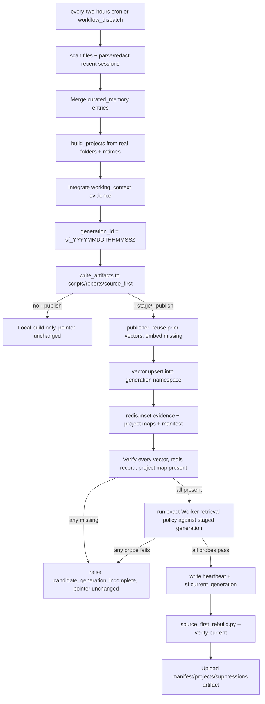

# Source-first rebuild workflow

The source-first rebuild is the only scheduled maintenance job after the
source-first cutover. It builds a complete candidate evidence generation
from source documents, verifies it, and atomically promotes it as the
serving generation. It does **not** mutate memory, infer identity, or run
Dream-style consolidation.

This workflow is the operational counterpart to the
[Source-first memory model](../domain/source-first-memory.md). It replaced
the retired nightly semantic-maintenance and sleep-report cron jobs (see
[Operations and local workflow](../operations.md)).

## What it does

- Scan authoritative source files under configured Dropbox roots and
  explicit pinned files, using `ingestion/source_first/scanner.py`.
- Parse and redact recent Claude Code and Codex conversational turns directly,
  then combine them with file evidence in the same `EvidenceRecord` corpus.
- Chunk, normalize, and checksum each source into immutable records.
- Derive a project catalog from real folders and file mtimes.
- Embed new/changed chunks with `text-embedding-3-large` (3072 dims),
  reusing prior-generation vectors for unchanged checksums.
- Write the candidate generation into its own Vector namespace and
  generation-scoped Redis keys.
- Verify every expected vector, Redis record, project map, and source map exists.
- Run all enabled retrieval probes against the staged generation using the exact
  production Worker search implementation.
- Only if storage and retrieval verification pass, atomically swap
  `sf:current_generation`.
- Upload build evidence (manifest, projects, suppressions) as a workflow
  artifact.

## Entrypoints

### `scripts/source_first_rebuild.py`

The CLI driver. It is intentionally dependency-light: the GitHub Actions
workflow creates a minimal venv (`ingestion/.venv-source-first`) and
installs only `openai`, `upstash-redis`, `upstash-vector`, and
`python-dotenv`, independent of the legacy ingestion package's larger
dependency tree.

Modes:

- No flags — build candidate artifacts only (writes to
  `scripts/reports/source_first/<generation>/`). Does not publish.
- `--publish` — build, publish, and atomically promote. Requires Upstash +
  OpenAI credentials.
- `--stage` — build and publish an immutable candidate without changing the
  live pointer.
- `--verify-generation <id>` — verify a staged generation.
- `--promote-generation <id>` — promote an already verified candidate.
- `--verify-current` — verify the currently promoted remote generation
  without building. Exits non-zero if verification fails.

Config defaults point at `shared/source_first_config.json`,
`shared/source_first_curated_memory.json`, and
`shared/source_first_suppressions.json`. The build aborts if any
`required_projects` path is missing or if no evidence records are produced.

### `ingestion/source_first/publisher.py`

`SourceFirstPublisher` owns the publish and verify contract. See the
[Source-first memory model](../domain/source-first-memory.md) page for the
atomic-generation invariant and Redis/Vector key scheme. The publisher
loads its own `.env` (ingestion, parent, or distillation folder) and is
injectable for tests (`redis`, `vector`, `openai` constructor args).

### `.github/workflows/source-first-rebuild.yml`

The `Source-First Memory Rebuild` GitHub Actions workflow is the only
scheduled maintenance job after cutover:

- `cron: "17 */2 * * *"` (every two hours), plus `workflow_dispatch` with a
  `publish` boolean input (default `true`).
- Runs on the self-hosted macOS runner (`knowledge-agent-sessions` label)
  because the runner can read the authoritative Dropbox folders on the Mac.
  There is **no local launchd job** for this workflow.
- `concurrency.group: source-first-memory-rebuild` with
  `cancel-in-progress: false` so a long run is not interrupted by the next
  schedule.
- Every run stages and candidate-tests a generation. Scheduled runs promote;
  manual dispatch follows the `publish` input.
- After a publish, a separate step runs
  `python scripts/source_first_rebuild.py --verify-current`.
- Build evidence (`manifest.json`, `projects.json`, `suppressions.json`
  per generation) is uploaded as a 30-day-retention artifact.

## Build and promote lifecycle

The rebuild lifecycle: a candidate generation is built, verified against strict count checks, and only then atomically promoted as the serving generation.

## Relationship to the retired nightly jobs

The source-first cutover retired two previously-scheduled workflows from
automatic operation (both now `workflow_dispatch`-only with explicit
"Retired from automatic operation by the source-first cutover" comments):

- `.github/workflows/nightly-semantic-maintenance.yml` — was
  `cron: "20 7 * * *"`, fed bounded semantic-duplicate candidate clusters
  to the Worker queue. Now a manual-only rollback path while the legacy
  index remains archived.
- `.github/workflows/nightly-sleep-report.yml` — was
  `cron: "45 8 * * *"`, verified durable completion of the semantic
  maintenance cohort. Now manual-only for inspecting the archived legacy
  system.

The production Worker also no longer has a Dream cron:
`cloudflare-mcp/mcp-server/wrangler.json` sets `triggers.crons: []` in both
production and staging. The [nightly orchestrator](nightly-orchestration.md)
and [Cloudflare MCP and Dream control plane](../architecture/mcp-and-dream.md)
remain in the codebase for staging validation and as the legacy path, but
production serving no longer depends on Dream mutation.

## When to consult this page

- Changing the rebuild schedule, runner, or publish gating.
- Adding a new source root, pinned file, or required project.
- Debugging a failed promotion or a `candidate_generation_incomplete` error.
- Changing embedding reuse or the verification count checks.

## Change recipe: add a required project

1. Add the project folder path to `required_projects` in
   `shared/source_first_config.json`.
2. Confirm the folder exists on the self-hosted runner's Dropbox mount.
3. Run `python scripts/source_first_rebuild.py` locally (no `--publish`) to
   confirm the project appears in the generated `projects.json`.
4. Run `python -m unittest tests.python.test_source_first` — the
   `test_required_project_without_docs_still_appears` test pins the
   behavior that a required project with no scanned docs still appears in
   the catalog.
5. Dispatch the workflow with `publish: false` first to validate the
   candidate, then `publish: true` to promote.

## Focused tests

- `tests/python/test_source_first.py::SourceFirstScannerTests` — chunking
  determinism, boilerplate stripping, authoritative-file filtering,
  required-project appearance.
- `tests/python/test_source_first.py::SourceFirstPublisherTests` —
  pointer-moves-only-after-complete and
  failed-candidate-does-not-replace-working-pointer invariants, verified
  with `FakeRedis` / `FakeVector` / `FakeEmbeddings` doubles.
- `cloudflare-mcp/mcp-server/test/sourceFirst.test.ts` — Worker-side
  scoring, suppression, and project-index behavior.

## Main source anchors

- `scripts/source_first_rebuild.py`
- `ingestion/source_first/publisher.py`
- `ingestion/source_first/scanner.py`
- `ingestion/source_first/models.py`
- `.github/workflows/source-first-rebuild.yml`
- `shared/source_first_config.json`
- `shared/source_first_curated_memory.json`
- `shared/source_first_suppressions.json`
